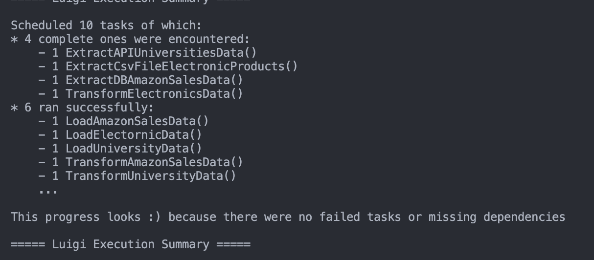
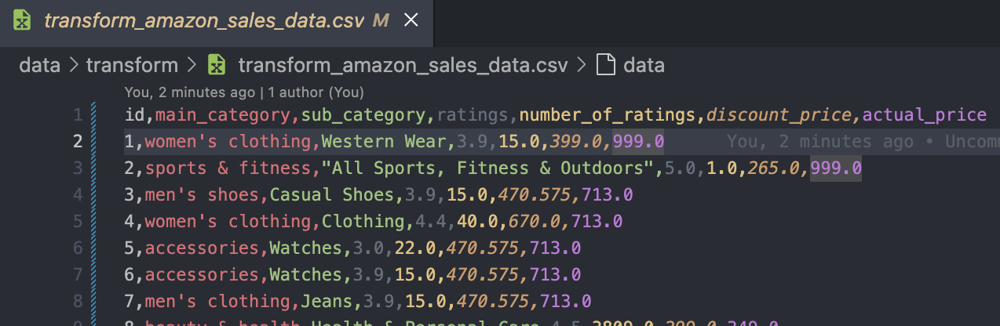
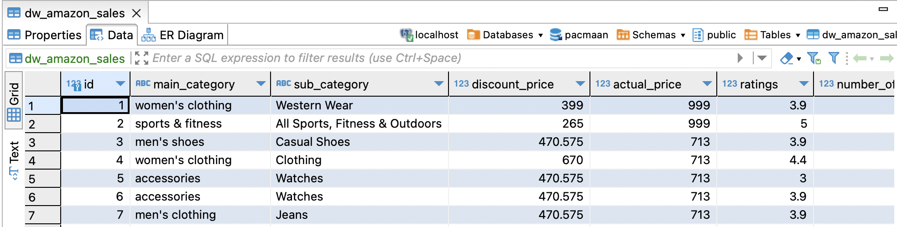
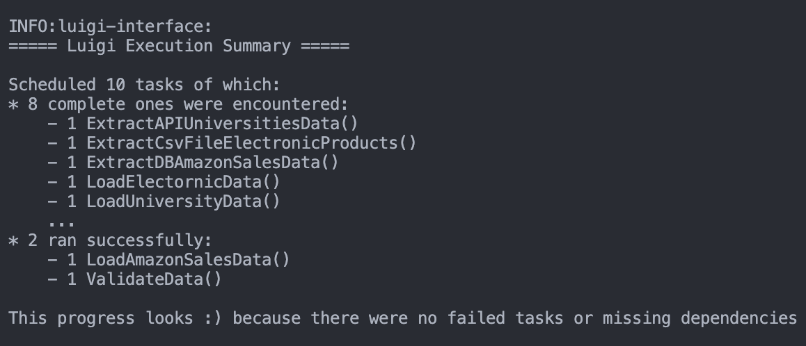
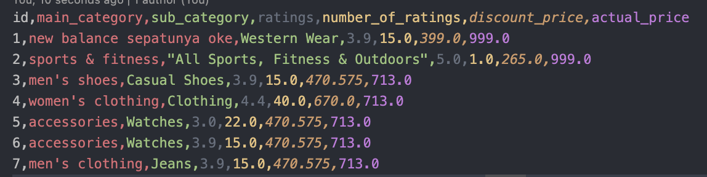
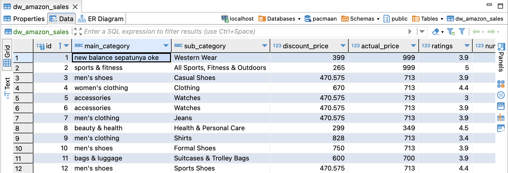
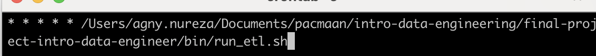

# Proyek Akhir: Introduction to Data Engineering

## Requirements Gathering & Solution

### Data Source
1. Data penjualan: Diperoleh dari Docker image https://hub.docker.com/r/shandytp/amazon-sales-data-docker-db
   - Untuk menjalankan kontainer Docker: `docker run --platform linux/amd64 -d -p 5433:5432 shandytp/amazon-sales-data-docker-db:latest`
2. Data pemasaran: Bersumber dari file CSV `ElectronicsProductsPricingData.csv`
3. Data universitas: Diambil dari REST API http://universities.hipolabs.com/search?country=Indonesia, yang menyediakan data untuk universitas-universitas di seluruh Indonesia

### Problem
1. Tim Penjualan & Pemasaran menghadapi kesulitan dalam memperoleh data produk karena data tersebar di berbagai file, sehingga sulit untuk menganalisis kinerja produk.
2. Tim Penjualan ingin mengidentifikasi produk dengan rating pelanggan tertinggi dari data penjualan.
3. Tim Pemasaran ingin menentukan produk elektronik yang paling populer di setiap kategori.
4. Tim Penjualan tertarik untuk memahami pola domain yang umum digunakan oleh universitas-universitas di Indonesia.

### Solution
1. Melakukan proses ETL (Extract, Transform, Load) untuk menggabungkan semua data ke dalam satu database.
2. Menggunakan Luigi sebagai penjadwal alur kerja
3. Menentukan skema gudang data yang sesuai dengan kebutuhan bisnis dan memungkinkan analisis setiap masalah.
4. Mengimplementasikan penjadwal untuk memastikan pembaruan data secara berkelanjutan dari berbagai sumber ke gudang data.
5. Mengimplementasikan proses upsert untuk menangani perubahan pada tabel-tabel.

### Schema Data Warehouse

1. Tabel `dw_amazon_sales`:
   - id (primary key)
   - main_category
   - sub_category
   - ratings
   - number_of_ratings
   - discount_price
   - actual_price
   - created_at
2. Tabel `dw_electronic_products`:
   - id (primary key)
   - electronic_id
   - category_name
   - product_name
   - upc
   - weight_gram
   - price
   - currency
   - availability
   - condition
   - manufacturer
   - is_sale
   - release_date
   - created_at
3. Untuk tabel `dw_universities`:
   - id (primary key)
   - name
   - country
   - website
   - domain
   - created_at

## ETL Processing

### Langkah-langkah yang terlibat dalam proses ETL
1. Mengekstrak data dari berbagai sumber dan memuat data tersebut ke area staging dalam format CSV.
2. Melakukan validasi data dengan memeriksa bentuk data, tipe data, dan menangani nilai yang hilang.
3. Menerapkan transformasi jika diperlukan, seperti menggabungkan tabel dan membersihkan data dengan memeriksa nama kolom, nilai di setiap kolom, dan memilih kolom yang relevan untuk disimpan di gudang data.
4. Memuat semua data yang telah ditransformasi ke gudang data dalam satu database.

### Desain Alur ETL

Diagram berikut menggambarkan desain alur ETL:

Desain alur ETL terdiri dari komponen-komponen berikut:

1. **Extract**: Tahap ini mengambil data dari berbagai sumber, termasuk file CSV produk elektronik, API universitas, dan Docker DB penjualan Amazon.

2. **Validation**: Data yang diekstrak menjalani pemeriksaan validasi, termasuk memverifikasi bentuk data, tipe data, dan menangani nilai yang hilang.

3. **Transform**: Pada tahap ini, tugas-tugas transformasi data dilakukan, seperti menerapkan teknik pembersihan data.

4. **Load**: Data yang telah ditransformasi dimuat ke data warehouse untuk analisis lebih lanjut.

5. **Extract Directory**: Ini merepresentasikan direktori tempat data yang diekstrak disimpan sebelum diolah.

Tanda panah menunjukkan aliran data antara berbagai tahap alur ETL.

Desain keseluruhan di jalankan dengan luigi dan proses insert data kedalam data warehouse dilakukan dengan metode upsert, kemudian di set proses scheduling dengan menggunakan crontab

### Testing Scenario 1
1. dalam scenario pertama ini raw data di load ke data warehouse dengan menggunakan luigi untuk workflow dependency nya

2. contoh salah satu data csv amazon sales

3. contoh data yang masuk ke data data warehouse di table amazon sales

### Testing Scenario 2
1. dalam scenario kedua terlihat hanya beberapa proses saja yang jalan karena hanya dirubah data csv yang amazon sales

2. contoh salah satu data csv amazon sales yang dirubah

3. contoh data yang masuk ke data data warehouse di table amazon sales ketika dirubah

### Set up Crontab
1. RUN `crontab -e`
2. set the timer and path to the runner file

### Running from Source Code
1. jangan lupa untuk membuat table terlebih dahulu , RUN `python3 create_table.py`
2. RUN `python3 main.py`

### Running from Dockerfile
1. RUN `docker build -t final-data-engineering .`
2. RUN `docker run engineering`

## Completed (90%)

- [x] Requirements Gathering & Solution
- [x] ETL Pipeline Design:
  - [x] Membuat Design ETL Pipeline
  - [x] Penjelasan mengenai Design ETL Pipeline
- [x] ETL Implementation:
  - [x] Membuat ETL Pipeline
  - [x] Extract seluruh source data
  - [x] ETL Scheduling
  - [x] Membuat Dockerfile / Docker Image
- [x] Testing Scenario
- [x] Publikasi Project di Github
- [ ] Video Presentasi