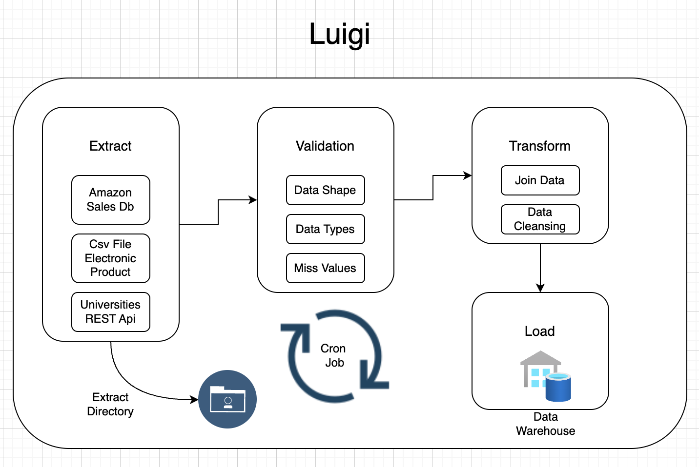

# Final Project: Introduction to Data Engineering

## Requirements Gathering & Proposed Solution

### Data Sources
1. Sales data: Obtained from the Docker image https://hub.docker.com/r/shandytp/amazon-sales-data-docker-db
   - To run the Docker container: `docker run --platform linux/amd64 -d -p 5433:5432 shandytp/amazon-sales-data-docker-db:latest`
2. Marketing data: Sourced from the CSV file `ElectronicsProductsPricingData.csv`
3. University data: Retrieved from the REST API http://universities.hipolabs.com/search?country=Indonesia, which provides data for universities throughout Indonesia

### Problems
1. The Sales & Marketing team faces difficulties in obtaining product data due to the scattered nature of the data across various files, making it challenging to analyze product performance.
2. The Sales team wants to identify the products with the highest customer ratings from the sales data.
3. The Marketing team wants to determine the most popular electronic products in each category.
4. The Sales team is interested in understanding the common domain patterns used by universities in Indonesia.

### Proposed Solutions
1. Perform ETL (Extract, Transform, Load) processes to consolidate all the data into a single database.
2. Use luigi as workflow scheduler
3. Define a data warehouse schema that aligns with the business requirements and enables analysis of each problem.
4. Implement a scheduler to ensure continuous updates of the data from various sources to the data warehouse.
5. Implement an upsert process to handle any changes in the tables.

### Data Warehouse Schema

1. For the `amazon_sales_data` table:
   - id(primary key)
   - product_name
   - main_category
   - sub_category
   - ratings
   - number_of_ratings
   - discount_price
   - actual_size
2. For the `electronic_product_pricing_data` table:
   - id(primary key)
   - category_name
   - product_name
   - upc
   - weight
   - price
   - currency
   - availability
   - condition
   - manufacturer
   - is_sale
3. For the `universities` table:
   - id(primary key)
   - name
   - country
   - alpha_two_code
   - domain
   - web_page_url

## ETL Process

### Steps involved in the ETL process
1. Extract data from various sources and load it into a staging area in CSV format.
2. Perform data validation by checking data shape, data types, and handling missing values.
3. Apply transformations if necessary, such as joining tables and cleansing data by examining column names, values in each column, and selecting the relevant columns to be stored in the data warehouse.
4. Load all the transformed data into the data warehouse within a single database.

### Design ETL Pipeline

The following diagram illustrates the design of the ETL pipeline:

The ETL pipeline design consists of the following components:

1. **Extract**: This stage retrieves data from various sources, including Csv file electronic product, API universities and Docker DB Amazon sales.

2. **Validation**: The extracted data undergoes validation checks, including verifying data shape, data types, and handling missing values.

3. **Transform**: In this stage, data transformation tasks are performed, such as applying data cleansing techniques.

4. **Load**: The transformed data is loaded into the data warehouse for further analysis and reporting.

5. **Extract Directory**: This represents the directory where the extracted data is stored before being processed.

The arrows indicate the flow of data between the different stages of the ETL pipeline.

The overall design is presented within a visually appealing layout, with a green border and the title "Luigi" at the top. Icons are used to represent specific technologies or components, such as PostgreSQL and Docker.